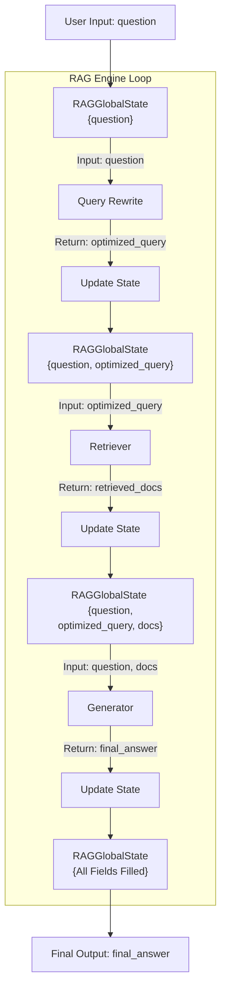
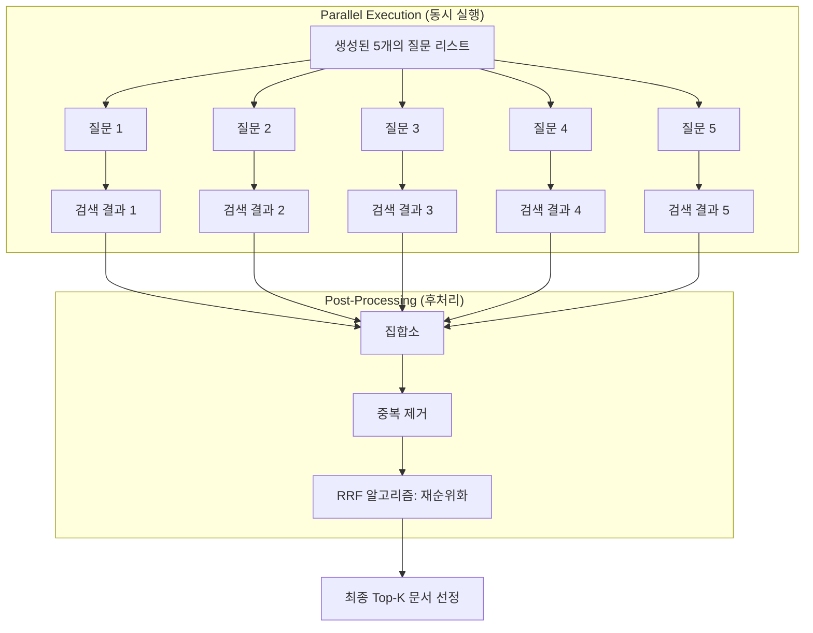

```mermaid
graph TD
    Input["User Input: question"] --> GlobalState
    
    subgraph "RAG Engine Loop"
        GlobalState["RAGGlobalState <br/> {question}"]
        
        %% Node 1
        GlobalState -- "Input: question" --> Node1["Query Rewrite"]
        Node1 -- "Return: optimized_query" --> Merge1["Update State"]
        Merge1 --> State1["RAGGlobalState <br/> {question, optimized_query}"]
        
        %% Node 2
        State1 -- "Input: optimized_query" --> Node2["Retriever"]
        Node2 -- "Return: retrieved_docs" --> Merge2["Update State"]
        Merge2 --> State2["RAGGlobalState <br/> {question, optimized_query, docs}"]
        
        %% Node 3
        State2 -- "Input: question, docs" --> Node3["Generator"]
        Node3 -- "Return: final_answer" --> Merge3["Update State"]
        Merge3 --> StateFinal["RAGGlobalState <br/> {All Fields Filled}"]
    end
    
    StateFinal --> Output["Final Output: final_answer"]

```

```mermaid
graph TD
    Input["생성된 5개의 질문 리스트"]

    subgraph "Parallel Execution (동시 실행)"
        Input --> Q1["질문 1"]
        Input --> Q2["질문 2"]
        Input --> Q3["질문 3"]
        Input --> Q4["질문 4"]
        Input --> Q5["질문 5"]

        Q1 --> S1["검색 결과 1"]
        Q2 --> S2["검색 결과 2"]
        Q3 --> S3["검색 결과 3"]
        Q4 --> S4["검색 결과 4"]
        Q5 --> S5["검색 결과 5"]
    end
    
    S1 --> Aggregator["집합소"]
    S2 --> Aggregator
    S3 --> Aggregator
    S4 --> Aggregator
    S5 --> Aggregator
    
    subgraph "Post-Processing (후처리)"
        Aggregator --> Dedupe["중복 제거"]
        Dedupe --> RRF["RRF 알고리즘: 재순위화"]
    end
    
    RRF --> FinalDocs["최종 Top-K 문서 선정"]

```